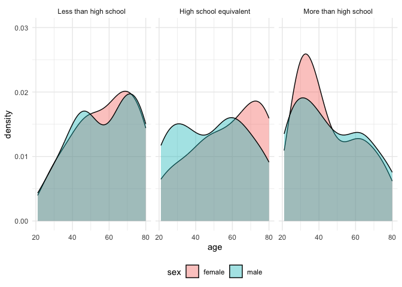

p8105_hw3_kac2301
================
Kate Colvin

## Question 1

``` r
library(p8105.datasets)
data("ny_noaa")
```

## Question 2

Loading in data, cleaning names and renaming variables, creating merged
dataframe

``` r
accel_df <- read_csv("data/nhanes_accel.csv") %>% 
  janitor::clean_names()
```

    ## Rows: 250 Columns: 1441
    ## ── Column specification ────────────────────────────────────────────────────────
    ## Delimiter: ","
    ## dbl (1441): SEQN, min1, min2, min3, min4, min5, min6, min7, min8, min9, min1...
    ## 
    ## ℹ Use `spec()` to retrieve the full column specification for this data.
    ## ℹ Specify the column types or set `show_col_types = FALSE` to quiet this message.

``` r
covar_df <- read_csv("data/nhanes_covar.csv")
```

    ## New names:
    ## Rows: 254 Columns: 5
    ## ── Column specification
    ## ──────────────────────────────────────────────────────── Delimiter: "," chr
    ## (5): ...1, 1 = male, ...3, ...4, 1 = Less than high school
    ## ℹ Use `spec()` to retrieve the full column specification for this data. ℹ
    ## Specify the column types or set `show_col_types = FALSE` to quiet this message.
    ## • `` -> `...1`
    ## • `` -> `...3`
    ## • `` -> `...4`

``` r
names(covar_df) <- c("seqn", "sex", "age", "bmi", "education")
covar_df <- covar_df %>% 
  slice(-1:-4) %>% 
  mutate(sex = 
           case_match(
             sex, 
             "1" ~ "male",
             "2" ~ "female"), 
         education = 
           case_match(
             education,
             "1" ~ "Less than high school", 
             "2" ~ "High school equivalent", 
             "3" ~ "More than high school"), 
         seqn = as.double(seqn), 
         age = as.integer(age))


# merging tables, filtering variable values that we want into final dataset

nhanes_df <- left_join(covar_df, accel_df, by = "seqn") %>% 
  arrange(seqn) %>% 
  filter(age >= 21) %>% 
  drop_na() %>% 
  mutate(bmi = as.double(bmi), 
         education = factor(education, 
                            ordered = TRUE, 
                            levels = c("Less than high school", 
                                       "High school equivalent", 
                                       "More than high school")))
head(nhanes_df)
```

    ## # A tibble: 6 × 1,445
    ##    seqn sex      age   bmi education  min1  min2  min3  min4   min5   min6  min7
    ##   <dbl> <chr>  <int> <dbl> <ord>     <dbl> <dbl> <dbl> <dbl>  <dbl>  <dbl> <dbl>
    ## 1 62161 male      22  23.3 High sch… 1.11  3.12  1.47  0.938 1.60   0.145  2.10 
    ## 2 62164 female    44  23.2 More tha… 1.92  1.67  2.38  0.935 2.59   5.22   2.39 
    ## 3 62169 male      21  20.1 High sch… 5.85  5.18  4.76  6.48  6.85   7.24   6.12 
    ## 4 62174 male      80  33.9 More tha… 5.42  3.48  3.72  3.81  6.85   4.45   0.561
    ## 5 62177 male      51  20.1 High sch… 6.14  8.06  9.99  6.60  4.57   2.78   7.10 
    ## 6 62178 male      80  28.5 High sch… 0.167 0.429 0.131 1.20  0.0796 0.0487 0.106
    ## # ℹ 1,433 more variables: min8 <dbl>, min9 <dbl>, min10 <dbl>, min11 <dbl>,
    ## #   min12 <dbl>, min13 <dbl>, min14 <dbl>, min15 <dbl>, min16 <dbl>,
    ## #   min17 <dbl>, min18 <dbl>, min19 <dbl>, min20 <dbl>, min21 <dbl>,
    ## #   min22 <dbl>, min23 <dbl>, min24 <dbl>, min25 <dbl>, min26 <dbl>,
    ## #   min27 <dbl>, min28 <dbl>, min29 <dbl>, min30 <dbl>, min31 <dbl>,
    ## #   min32 <dbl>, min33 <dbl>, min34 <dbl>, min35 <dbl>, min36 <dbl>,
    ## #   min37 <dbl>, min38 <dbl>, min39 <dbl>, min40 <dbl>, min41 <dbl>, …

Creating long form table

``` r
nhanes_df_longer <- nhanes_df %>% 
  pivot_longer(min1:min1440, 
               names_to = "minute_number", 
               values_to = "mims", 
               names_prefix = "min") %>% 
  mutate(minute_number = as.integer(minute_number))

head(nhanes_df_longer)
```

    ## # A tibble: 6 × 7
    ##    seqn sex     age   bmi education              minute_number  mims
    ##   <dbl> <chr> <int> <dbl> <ord>                          <int> <dbl>
    ## 1 62161 male     22  23.3 High school equivalent             1 1.11 
    ## 2 62161 male     22  23.3 High school equivalent             2 3.12 
    ## 3 62161 male     22  23.3 High school equivalent             3 1.47 
    ## 4 62161 male     22  23.3 High school equivalent             4 0.938
    ## 5 62161 male     22  23.3 High school equivalent             5 1.60 
    ## 6 62161 male     22  23.3 High school equivalent             6 0.145

Creating table for the number of men and women in each education
category

``` r
nhanes_df %>% group_by(education, sex) %>% 
  summarize(count = n())
```

    ## `summarise()` has grouped output by 'education'. You can override using the
    ## `.groups` argument.

    ## # A tibble: 6 × 3
    ## # Groups:   education [3]
    ##   education              sex    count
    ##   <ord>                  <chr>  <int>
    ## 1 Less than high school  female    28
    ## 2 Less than high school  male      27
    ## 3 High school equivalent female    23
    ## 4 High school equivalent male      35
    ## 5 More than high school  female    59
    ## 6 More than high school  male      56

Looking at the above table, the count of men and women in each education
level seems roughly equivalent, except that many more men have a high
school equivalent level of education.

Creating visualization of the age distributions for men and women in
each education category

``` r
nhanes_df %>% ggplot(aes(x = age, fill = sex)) +
  geom_density(alpha = 0.4) +
  facet_grid(~education) +
  theme_minimal() +
  theme(legend.position = "bottom") +
  ylim(0, 0.03)
```

<!-- -->

Looking at the above plots, it’s immediately obvious that most of the
people with an education beyond high school are young men and women
(people under 40 years old), and are generally primarily women. Looking
at the lower two education categories, it seems like the people with
less than a high school degree are primarily middle-aged and older
(older than 45), and that people with a high school equivalent are split
by age and by gender. Most of the people with a high school equivalent
who are older than 50 are women, while the people who are younger are
mostly men.

Aggregating across minutes to create a total activity variable for each
participant

``` r
nhanes_df <- nhanes_df %>% 
  group_by(seqn) %>% 
  mutate(
    total_activity = sum(c_across(min1:min1440)))
```

Creating plot of total activities vs. age

``` r
nhanes_df %>% ggplot(aes(x = age, y = total_activity, color = sex)) +
  geom_point() +
  facet_grid(~education) + 
  theme(legend.position = "bottom") +
  geom_smooth(se = FALSE)
```

    ## `geom_smooth()` using method = 'loess' and formula = 'y ~ x'

<!-- -->

For all education levels and genders, total activity goes down with age.
Interestingly, for people with less than a high school degree, they
start with a much higher level of physical activity than the other two
education levels, but eventually does decline to about the same level.
People with more than a high school degree have the most consistent
total activity levels across age compared to the other two education
categories.

Creating plots of the 24-hour activity time courses for each education
level

``` r
# Non-aggregated plot

nhanes_df_longer %>% ggplot(aes(x = minute_number, y = mims, color = sex)) + 
  geom_line(size = 0.1, alpha = 0.3) + 
  facet_grid(~education) + 
  geom_smooth() + 
  theme(legend.position = "bottom")
```

    ## Warning: Using `size` aesthetic for lines was deprecated in ggplot2 3.4.0.
    ## ℹ Please use `linewidth` instead.
    ## This warning is displayed once every 8 hours.
    ## Call `lifecycle::last_lifecycle_warnings()` to see where this warning was
    ## generated.

    ## `geom_smooth()` using method = 'gam' and formula = 'y ~ s(x, bs = "cs")'

<!-- -->

Creating a clearer plot with MIMS averaged by gender for each minute

``` r
nhanes_df_longer %>% group_by(minute_number, sex, education) %>% 
  summarize(
    mims_sum = mean(mims)) %>% 
  ggplot(aes(x = minute_number, y = mims_sum, color = sex)) + 
  geom_line(alpha = 0.5) + 
  facet_grid(~education) + 
  geom_smooth() + 
  theme(legend.position = "bottom")
```

    ## `summarise()` has grouped output by 'minute_number', 'sex'. You can override
    ## using the `.groups` argument.
    ## `geom_smooth()` using method = 'gam' and formula = 'y ~ s(x, bs = "cs")'

<!-- -->

Looking at the plots above, it’s clear that there is large variance in
the amount of physical activity people are getting based on the MIMS
measurement. One interesting finding is that the difference in physical
activity between men and women increases with education level.
Specifically, women become more active than men at higher education
levels. Additionally, it’s interesting that the area with the lowest
amount of physical activity in each graph is very narrow, indicating
that theres only an hour or two where most people are sleeping/resting
at around 4AM.

## Question 3

Loading in, cleaning, and merging datasets

``` r
jan2020_df <- read_csv("data/citibike/Jan 2020 Citi.csv") %>% 
  mutate(year = 2020, month = "January")
```

    ## Rows: 12420 Columns: 7
    ## ── Column specification ────────────────────────────────────────────────────────
    ## Delimiter: ","
    ## chr (6): ride_id, rideable_type, weekdays, start_station_name, end_station_n...
    ## dbl (1): duration
    ## 
    ## ℹ Use `spec()` to retrieve the full column specification for this data.
    ## ℹ Specify the column types or set `show_col_types = FALSE` to quiet this message.

``` r
july2020_df <- read_csv("data/citibike/July 2020 Citi.csv") %>% 
  mutate(year = 2020, month = "July")
```

    ## Rows: 21048 Columns: 7
    ## ── Column specification ────────────────────────────────────────────────────────
    ## Delimiter: ","
    ## chr (6): ride_id, rideable_type, weekdays, start_station_name, end_station_n...
    ## dbl (1): duration
    ## 
    ## ℹ Use `spec()` to retrieve the full column specification for this data.
    ## ℹ Specify the column types or set `show_col_types = FALSE` to quiet this message.

``` r
jan2024_df <- read_csv("data/citibike/Jan 2024 Citi.csv") %>% 
  mutate(year = 2024, month = "January")
```

    ## Rows: 18861 Columns: 7
    ## ── Column specification ────────────────────────────────────────────────────────
    ## Delimiter: ","
    ## chr (6): ride_id, rideable_type, weekdays, start_station_name, end_station_n...
    ## dbl (1): duration
    ## 
    ## ℹ Use `spec()` to retrieve the full column specification for this data.
    ## ℹ Specify the column types or set `show_col_types = FALSE` to quiet this message.

``` r
july2024_df <- read_csv("data/citibike/July 2024 Citi.csv") %>% 
  mutate(year = 2024, month = "July")
```

    ## Rows: 47156 Columns: 7
    ## ── Column specification ────────────────────────────────────────────────────────
    ## Delimiter: ","
    ## chr (6): ride_id, rideable_type, weekdays, start_station_name, end_station_n...
    ## dbl (1): duration
    ## 
    ## ℹ Use `spec()` to retrieve the full column specification for this data.
    ## ℹ Specify the column types or set `show_col_types = FALSE` to quiet this message.

``` r
# Merging into one table

citi_df <- bind_rows(jan2020_df, july2020_df, jan2024_df, july2024_df) %>% 
    select(ride_id, rideable_type, duration, weekdays, month, 
         year, start_station_name, end_station_name, member_casual)

head(citi_df)
```

    ## # A tibble: 6 × 9
    ##   ride_id         rideable_type duration weekdays month  year start_station_name
    ##   <chr>           <chr>            <dbl> <chr>    <chr> <dbl> <chr>             
    ## 1 4BE06CB33B0370… classic_bike     15.3  Tuesday  Janu…  2020 Columbus Ave & W …
    ## 2 26886E03497449… classic_bike      5.31 Wednesd… Janu…  2020 2 Ave & E 96 St   
    ## 3 24DC56060EBE62… classic_bike      9.69 Friday   Janu…  2020 Columbia St & Riv…
    ## 4 EEDC1053582D02… classic_bike      7.00 Sunday   Janu…  2020 W 84 St & Columbu…
    ## 5 2CD4BD4CEE2E50… classic_bike      2.85 Friday   Janu…  2020 Forsyth St & Broo…
    ## 6 E18682F9A4E501… classic_bike     25.5  Sunday   Janu…  2020 Allen St & Hester…
    ## # ℹ 2 more variables: end_station_name <chr>, member_casual <chr>

The final merged data set above has 9 columns and 99,485 rows. Each row
represents a ride on a Citi Bike. Some of the important variables are
duration (minutes), weekdays, month, year, and member_casual (rider
status as a member or not).

Creating table of the total number of rides in each combination of year
and month, separating casual riders and members.

``` r
citi_df %>% group_by(year, month, member_casual) %>% 
  summarize(
    count = n()
  )
```

    ## `summarise()` has grouped output by 'year', 'month'. You can override using the
    ## `.groups` argument.

    ## # A tibble: 8 × 4
    ## # Groups:   year, month [4]
    ##    year month   member_casual count
    ##   <dbl> <chr>   <chr>         <int>
    ## 1  2020 January casual          984
    ## 2  2020 January member        11436
    ## 3  2020 July    casual         5637
    ## 4  2020 July    member        15411
    ## 5  2024 January casual         2108
    ## 6  2024 January member        16753
    ## 7  2024 July    casual        10894
    ## 8  2024 July    member        36262
